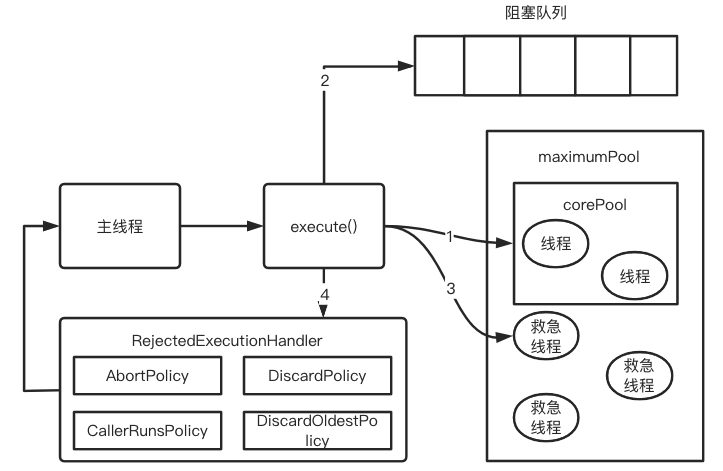

# 线程池

如果不用线程池，在高并发的情况下，我们执行异步任务的时候都要手动创建线程对象，如下

```java
new Thread(()->{
    异步任务
}).start()
```

这样做的缺点：

* 每次任务过来都要创建线程对象，执行完成后销毁，影响性能

* 同时来了10000个异步任务，岂不是要创建10000个线程去执行，10000个线程的上下文切换势必影响性能

因此我们必须在项目启动的时候维护一个线程池，比如规定50个线程，这50个就是去执行任务；同时还要有一个队列去缓存后面要执行的任务，具体的流程图如下：



值得注意：一旦创建了50个线程对象，这50个对象就一直存在，他们不断的从队列中获取任务执行

## 自定义线程池

```java
package com.zstu.concurrent.interview;

import java.util.HashSet;
import java.util.concurrent.LinkedBlockingQueue;

public class MyThreadPool {

	private int coreSize;
	
	//工作线程
	private HashSet<Runnable> workers = new HashSet<>();

	//等待队列
	private LinkedBlockingQueue<Runnable> taskQueue;

	public MyThreadPool(int coreSize, LinkedBlockingQueue taskQueue) {
		this.coreSize = coreSize;
		this.taskQueue=taskQueue;
	}

	class Worker extends Thread{
		private Runnable task;

		public Worker(Runnable task){
			this.task=task;
		}

		@Override
		public void run() {
			//执行任务
			//当task不为空，执行任务
			//当task执行完毕，再从队列获取任务并执行
            //注意：take不到会一直阻塞
			try{
				while (task != null || (task = taskQueue.take()) != null){
					try{
						task.run();
					} catch (Exception ex){
						ex.printStackTrace();
					} finally {
						task=null;
					}
				}
			} catch (Exception ex){
				ex.printStackTrace();
			}

		}
	}

	public void execute(Runnable task){
		synchronized (workers){
			if(workers.size() < coreSize){
				Worker worker = new Worker(task);
				workers.add(task);
				worker.start();
			}else{
				taskQueue.add(task);
			}
		}
	}
}
```

测试：

```java
package com.zstu.concurrent.interview;

import java.util.concurrent.LinkedBlockingQueue;

public class ThreadPoolExecutorDemo {
	public static void main(String[] args) throws InterruptedException {

		MyThreadPool myThreadPool = new MyThreadPool(2, new LinkedBlockingQueue(10));

		for (int i = 0; i < 10; i++) {
			final int j=i;
			myThreadPool.execute(()->{
				System.out.println(j+Thread.currentThread().getName()+"开始执行");
				try {
					Thread.sleep(5000);
				} catch (InterruptedException e) {
					e.printStackTrace();
				}
				System.out.println(j+Thread.currentThread().getName()+"执行结束");
			});
		}
	}
}
```

结果：

```
1Thread-1执行结束
0Thread-0执行结束
2Thread-1执行结束
3Thread-0执行结束
4Thread-1执行结束
5Thread-0执行结束
6Thread-1执行结束
7Thread-0执行结束
8Thread-1执行结束
9Thread-0执行结束
```

我们看到，整个过程自始至终就是两个线程在执行任务

## ThreadPoolExecutor

```java
public ThreadPoolExecutor(int corePoolSize,
                              int maximumPoolSize,
                              long keepAliveTime,
                              TimeUnit unit,
                              BlockingQueue<Runnable> workQueue,
                              ThreadFactory threadFactory,
                              RejectedExecutionHandler handler){
    ...
}
```

线程池的七大参数：

* `corePoolSize`：核心线程数，线程池中的常驻核心线程数

1. 在创建线程池后，当有请求任务来之后，就会安排池中的线程去执行请求任务，近似理解为今日当值线程
2. 在线程池中的线程数目达到corePoolSize后，就会把到达的队列放到缓存队列中

* `maximumPoolSize`：线程池能够容纳同时执行的最大线程数，此值必须大于等于1

`maximumPoolSize-corePoolSize`就是救急线程数量

* `keepAliveTime`：救急线程在空闲状态下的存活时间

1. 当救急线程空闲时间达到了keepAliveTime值时，多余的空闲线程会被销毁，直到只剩下corePoolSize个线程为止
2. 默认情况下，只有当线程池中的线程数大于corePoolSize时，即存在救急线程时keepAliveTime才会起作用

* `unit`：keepAliveTime单位
* `workQueue`：任务队列，被提交的但未被执行的任务（类似于银行里面的候客区）
  - `LinkedBlockingQueue`：链表阻塞队列
  - `SynchronousBlockingQueue`：同步阻塞队列
* `threadFactory`：表示生成线程池中工作线程的线程工厂，用于创建线程池 一般用默认即可
* `handler`：拒绝策略，表示当队列满了并且工作线程大于线程池的最大线程数（maximumPoolSize3）时，如何来拒绝请求执行的Runnable的策略

##  拒绝策略

以下所有拒绝策略都实现了`RejectedExecutionHandler`接口

- `AbortPolicy`：默认，直接抛出RejectedExcutionException异常，阻止系统正常运行
- `DiscardPolicy`：直接丢弃任务，不予任何处理也不抛出异常，如果运行任务丢失，这是一种好方案
- `CallerRunsPolicy`：该策略既不会抛弃任务，也不会抛出异常，而是将某些任务回退到调用者
- `DiscardOldestPolicy`：抛弃队列中等待最久的任务，然后把当前任务加入队列中尝试再次提交当前任务

## 为什么不用默认创建的线程池

```java
// 一池5个处理线程（用池化技术，一定要记得关闭）
ExecutorService threadPool = Executors.newFixedThreadPool(5);

// 创建一个只有一个线程的线程池
ExecutorService threadPool = Executors.newSingleThreadExecutor();

// 创建一个拥有N个线程的线程池，根据调度创建合适的线程
ExecutorService threadPool = Executors.newCacheThreadPool();
```

线程池创建的方法有：固定数的，单一的，可变的，那么在实际开发中，应该使用哪个？

我们一个都不用，在生产环境中是使用自己自定义的

为什么不用Executors中JDK提供的？

根据阿里巴巴手册：并发控制这章

- 线程资源必须通过线程池提供，不允许在应用中自行显式创建线程
  - 使用线程池的好处是减少在创建和销毁线程上所消耗的时间以及系统资源的开销，解决资源不足的问题，如果不使用线程池，有可能造成系统创建大量同类线程而导致消耗完内存或者“过度切换”的问题
- 线程池不允许使用Executors去创建，而是通过ThreadToolExecutors的方式，这样的处理方式让写的同学更加明确线程池的运行规则，规避资源耗尽的风险
  - Executors返回的线程池对象弊端如下：
    - FixedThreadPool和SingleThreadPool：
      - 运行的请求队列长度为：Integer.MAX_VALUE，可能会堆积大量的请求，从而导致OOM
    - CacheThreadPool和ScheduledThreadPool
      - 运行的请求队列长度为：Integer.MAX_VALUE，可能会堆积大量的请求，从而导致OOM